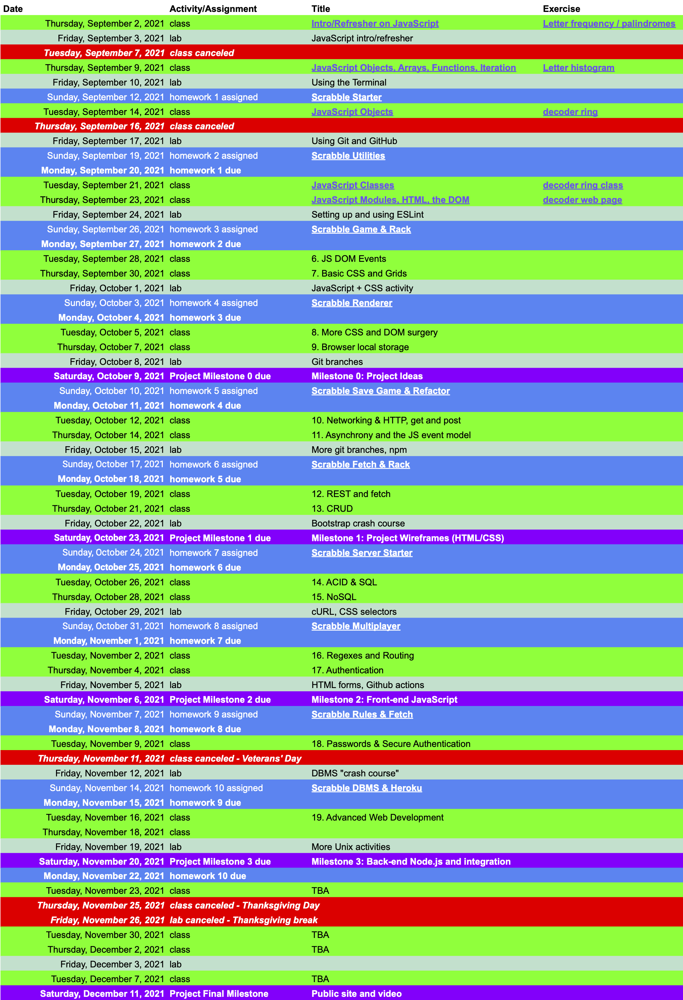

# [COMPSCI 326 Web Programming](https://web-programming.org)
## Fall 2022
## Professor [Emery Berger](https://www.emeryberger.com)

- **Lectures:** TuTh 1:00PM - 2:15PM, Goessmann Laboratory room 20
- **Labs:** Fr 4:00PM - 4:50PM, Goessmann Laboratory room 20
- **Course web page:** [https://web-programming.org](https://web-programming.org)
- **Recommended IDEs:** [Visual Studio Code](https://code.visualstudio.com/)
- **TAs:** [Hunter McNichols](mailto:wmcnichols@umass.edu), [Dzung Pham](mailto:dungpham@umass.edu)
- **UCAs:** TBD
- **Office hours:**
  - Professor Berger: TBD, also by appointment over Zoom
  - TAs/UCAs: by appointment; also available after class and before labs
- **Slack:** [COMPSCI 326 Fall 2022 Slack](https://web-programming-f2022.slack.com)
- **Piazza:** [COMPSCI 326 Fall 2022 Piazza](https://piazza.com/umass/fall2022/compsci326/home)
- **Course syllabus:** [syllabus](https://web-programming.org/syllabus)

### Course Overview

The web is arguably today's most important application platform. Web browsers run on practically every device, and even many phone applications are in fact web applications under the covers. This course will cover a broad range of client-side web technologies, including HTTP itself, HTML5, CSS, and JavaScript; it will additionally cover key concepts for the server side of web applications, including key value stores and SQL servers. This course will also cover key concepts and technologies including AJAX, JavaScript libraries (e.g., jQuery), and web security. This course is hands-on and heavily project-based; students will construct a substantial dynamic web application based on the concepts, technologies, and techniques presented during lectures and in readings. This course satisfies the IE Requirement.

### Required Text

There is no required text.

### Course Development Environment

Given that this is a programming intensive course, it is important to highlight the development environment! Generally, most of what we cover in this course is available on all the typical operating systems. However, the team project allows you to explore additional environments that may have specific OS requirements. You are welcome to use those additional libraries/tools; however, you will not receive direct support for what you use. It is your responsibility for the installation, setup, and use of those additional components. You are welcome to use any editor, IDE, or tools to explore this material.

We strongly recommend that you use [Visual Studio Code](https://code.visualstudio.com/). We have also purchased a [repl.it](http://repl.it) subscription for this class (link distributed on Slack).

### Other Material

It is assumed that you have a computer to use for assignments in this
course. You should make sure to commit your work frequently to
GitHub. We will not be able to accept excuses for missing or accidental deletion
of work.

_Note_: you may only use GitHub for storing your work on individual
assignments if you are using a private repository. Use of public
repositories to store assignment solutions on GitHub is considered
cheating and will result in a failure for this course.

You are welcome to store and share your team project work on a public repo!

### EVERYTHING BELOW HERE IS BEING UPDATED

### Full calendar

The above-linked Google sheet contains the up-to-date schedule and links for all lectures, labs, homeworks, and project milestones.

Homeworks are assigned on Tuesdays and due the following
Monday. Project milestones are due on Sundays.

### Project

| Milestone | Date |
| :-------- | :--- |
| [_Full project overview_](https://docs.google.com/document/d/1msb8op2QJIyz6Ke4sg6a-yoKexyJVzMfVFwHsX2Fqyc/edit?usp=sharing)    | _N/A_  |
| [Milestone 0: Project Ideas](https://docs.google.com/document/d/1aJ_TMdzxmewlhZQQac2QlnCV3lVbwPs-pZ5Iao2gBEs/edit?usp=sharing) | October 9  |
| [Milestone 1: Project Wireframes (HTML/CSS)](https://docs.google.com/document/d/1WsdY1qijEROoQCwYBcBc9YzEmK1AuBi2mdlkMaUXQ4Y/edit?usp=sharing)  | October 23  |
| [Milestone 2: Front-end JavaScript](https://docs.google.com/document/d/1U1iXfvlNBNziRkxjKIaDFUqQ8vpYtjOBgWLPY3GRJxg/edit?usp=sharing) | November 6 |
| [Milestone 3: Back-end Node.js and integration](https://docs.google.com/document/d/1zdw0vNJXx6sFG660pi8K8ETqm51jtXA3JnhxRa6Wxsc/edit?usp=sharing) | November 20 |
| Final: Public site + video | December 11 |

### Labs

[Lab notes](lab-info.md)

### Homeworks

Individual homeworks are assigned every Sunday and due the following Monday.

1. [Scrabble Starter](https://docs.google.com/document/d/17E0dt4u2sHYN9Kn3lBIP5RT1RMi4EZOZfumNDFjxMFw/edit?usp=sharing)
1. [Scrabble Utilities](https://docs.google.com/document/d/19nGdl5H4MVM8IdquUFmpJk9IpkZM44ps26VzMoCTHHg/edit?usp=sharing)
1. [Scrabble Game & Rack](https://docs.google.com/document/d/11b6L3gzx-5CZQSR9nBnx5As-PlOUx4VAccU5wnaRZXM/edit?usp=sharing)
1. [Scrabble Renderer](https://docs.google.com/document/d/15osPL4_BQyI7G4ZxliepDQRlYCJG4ZipOzoBC45fDmU/edit?usp=sharing)
1. [Scrabble Save Game & Refactor](https://docs.google.com/document/d/1Z99SWlJnV5jPNOu4_5PgsMc0N95XsANmHmi0XH-gqt0/edit?usp=sharing)
1. [Scrabble Fetch & Rack](https://docs.google.com/document/d/15oXPyuf-5VsyJ9TH7abLmDU-j67wriw7PbK4HihSFUU/edit?usp=sharing)
1. [Scrabble Server Starter](https://docs.google.com/document/d/1PMZxj9nLpOz3cgEN1gOTnzAMrmeVrfyf3cMjBRAD1eg/edit?usp=sharing)
1. [Scrabble Multiplayer](https://docs.google.com/document/d/1ZOXDYt0qjV7jXRSMHtA8ABhFhwFYutxoyc8eaaE2RcQ/edit?usp=sharing)
1. [Scrabble Rules & Fetch](https://docs.google.com/document/d/1XJbriuYZge-wbZCYqz88pjRKvoriAPFrh8aA8J1CITQ/edit?usp=sharing)
1. [Scrabble DBMS & Heroku](https://docs.google.com/document/d/1Fw9Mow9zuljjNqbtHCr47DXrFp7JZ1rx5hG13sPbx30/edit?usp=sharing)

### Acknowledgements

Thanks to Joseph Spitzer and Nicolas van Kempen (Fall 2020), and Ziwei
(William) He and Ishan Khatri (Spring 2020) for their help in
developing and curating these materials.